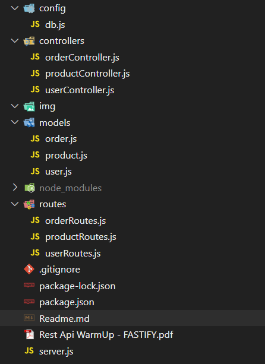
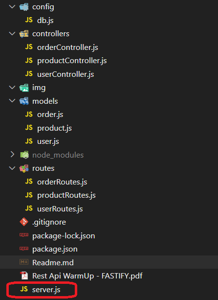
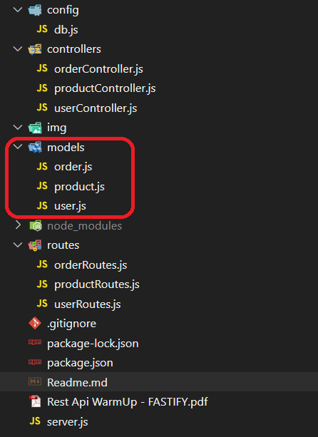
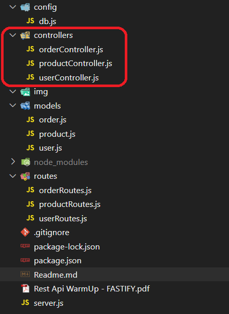
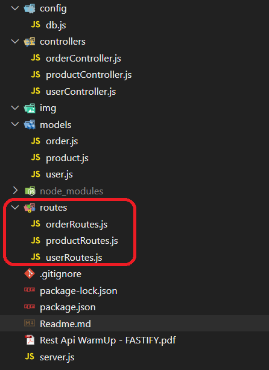
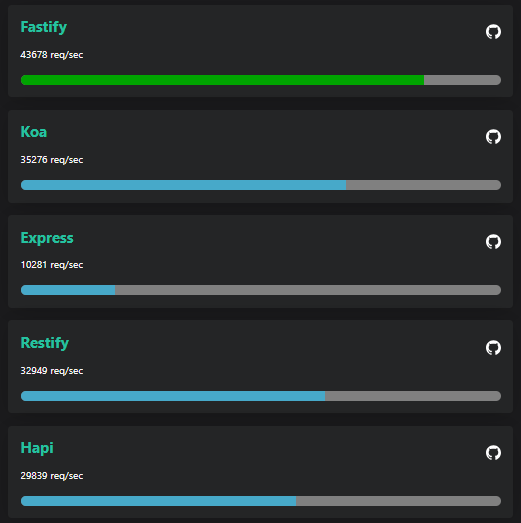

## Retour d'expérience

Ayant l'habitude de travailler avec le Framework Express, l'objectif de ce projet était de comprendre les principales différences entre ce Framework et Fastify.

Après avoir réalisé notre première API REST, nous avons pu voir qu'en réalité ces deux languages sont très similaires.

#### Architecture du projet

Pour le comprendre nous sommes partie sur une architecture MVC traditionnelles comme suit : 


- le répertoire **config** regroupe le paramétrage et la déclaration de l'instance séquelize qui s'occupera d'établir la communication avec la BDD;
- le répertoire **controller** permet de regrouper les différents fichiers qui gère la logique métier de l'application;
- le répertoire **models** regroupe les différents fichiers qui forment la structure des données de l'application. Utilisant l'ORM Sequelize, c'est dans ces fichiers que l'on déclare les tables et les dépendances qui seront créées dans la BDD au lancement de l'application;
- le répertoire **routes** regroupes les fichiers qui définissent les points d'entrées de notre API en spécifiant les URL, les méthodes HTTP (GET, POST, PUT, DELETE) et en associant chaque URL à un contrôleur spécifique;
- le fichier **server.js** est le point d'entrée du serveur et c'est ici que l'instance Fatsify est déclarée.

#### Quelques exemples de code

##### Initialisation de l'instance Fastify (server.js)
```js
import Fastify from 'fastify'
[...]
const fastify = Fastify({
  logger: true
})
```



##### Création d'un model (user.js)
La syntaxe est propre à sequelize
```js
import { DataTypes } from 'sequelize';
import {sequelize} from '../config/db.js';

const User = sequelize.define('users', {
  id: {
    type: DataTypes.UUID,
    defaultValue: DataTypes.UUIDV4,
    primaryKey: true,
  },
  email: {
    type: DataTypes.STRING(100),
    unique: true,
    allowNull: false,
  },
  [...déclaration des autres colonnes...]
});

export {User};
```


##### Controller d'une requête Http GET Async (userController.js)
Les requêtes permettant de récupérer des data auprès de la BDD sont des fonctions Sequelizes qui sont similaires aux requêtes noSQL (findAll, findOne, findByPk, create, delete, update, ...)
```js
import {User} from '../models/user.js'
[...]
const getAllUsers = async (req, res) => {
    try {
      const users = await User.findAll({});
      res.status(200).send(users);

    } catch (error) {
      res.status(500).send({ error: error.message });
    }
}
[...]
export {getAllUsers};
```


##### Déclaration des routes publiées sur notre serveur (userRoutes.js)
```js
import {  createUser,  getAllUsers,  getOneUser,  updateUser,  deleteUser} from '../controllers/userController.js';
import {  getUserOrder } from '../controllers/orderController.js';

function userRoutes(fastify, options, done) {
    
  fastify.post('/users', createUser);
  fastify.get('/users', getAllUsers);
  fastify.get('/users/:id', getOneUser);
  fastify.get('/users/:id/order', getUserOrder);
  fastify.put('/users/:id', updateUser);
  fastify.delete('/users/:id', deleteUser);

  done();
}

export {userRoutes};
```



##### Assimilation des routes avec Fastify (server.js)
```js
import {userRoutes} from './routes/userRoutes.js';
import {productRoutes} from './routes/productRoutes.js';
import {orderRoutes} from './routes/orderRoutes.js';
[...]
fastify.register(userRoutes);
fastify.register(productRoutes);
fastify.register(orderRoutes);
```

##### Lancement du serveur (server.js)
on lance le serveur en local sur le port 3000
```js
[...]
try {
  await fastify.listen({ port: 3000 })
} catch (err) {
  fastify.log.error(err)
  process.exit(1)
}
```


##### Gestion des erreurs + Transaction Sequelize (userController.js)
L'utilisation des transactions sequelize peuvent être très utiles pour effectuer des rollback en cas d'erreur
```js
    try {
        let transaction = await sequelize.transaction();
        [...]
        await transaction.commit();
        res.status(201).send({ user: newUser });

    } catch (error) {

        if (transaction) {
        await transaction.rollback();
        }

        if (error.name === 'SequelizeUniqueConstraintError') {
        res.status(400).send({ error: 'Adresse e-mail déjà utilisée.' });

        } else if (error.name === 'ValidationError') {
        res.status(400).send({ error: 'Données utilisateur non valides.' });

        } else {
        res.status(500).send({ error: 'Erreur interne du serveur.' });

        }
    }
```


##### Formatage de la requête qui sera interprétée en requete sql (orderController.js)
l'équivalent de la requête sql : 
```sql
SELECT USER.id, USER.email, USER.firstname, USER.lastname, USER.phone, PRODUCT.id, PRODUCT.name, PRODUCT.description, PRODUCT.amount, PRODUCT.rate, ORDER.id, ORDER.createdAt 
from ORDER 
inner join USER on USER.id = ORDER.user_id 
inner join PRODUCT on PRODUCT.id = ORDER.product_id```
```

avec sequelize :
```js
    const order = await Order.findAll({
      include : [
        {
          model: User,
          attributes: ['id', 'email', 'firstname', 'lastname', 'phone'],
        },
        {
          model: Product,
          attributes: ['id', 'name', 'description', 'amount', 'rate']
        }
      ],
      attributes : ['id', 'createdAt'],
    });
```


#### Les avantages de Fastify

- Compatibilité ESM;
- L'utilisation du framework Fastify est très similaire à l'utilisation du Framework Express
- L'écosystem de Fastify est plutôt complet et il reste assez simple d'ajouter des plugings supplémentaires via npm (la liste des plugins est [ici](https://fastify.dev/ecosytem/))

- Rapidité des requêtes
<div style="text-align: center;">


[benchmarks disponible sur : https://fastify.dev/benchmarks/](https://fastify.dev/benchmarks/)

</div>

#### Les inconvénients de Fastify

- La communauté liée à Fastify reste très restreinte (il n'y a presque pas d'article sur stackoverflow par exemple). En cas de problème lors du dévelopement on peut rapidement se retrouver confronter à nous même.
